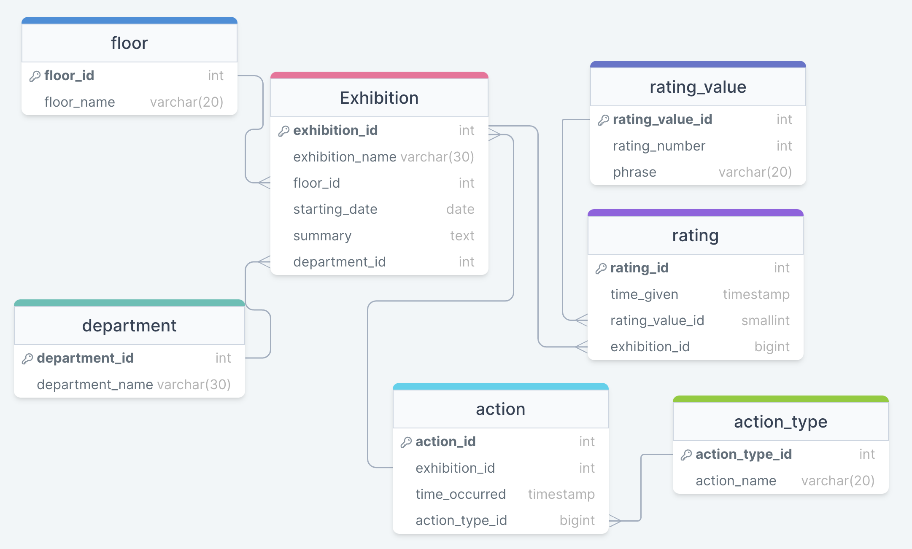
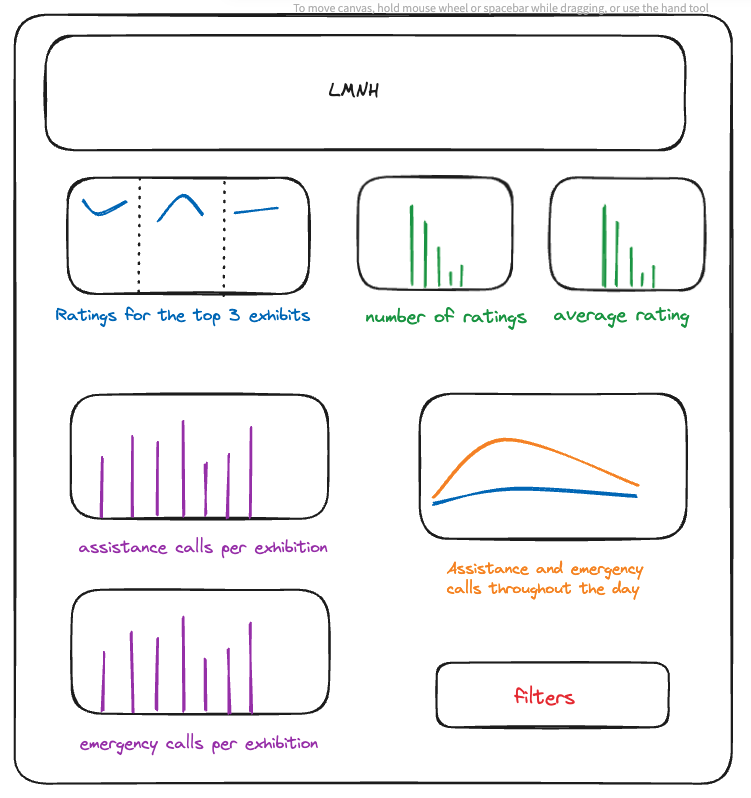

# Museum-ETL

This folder should contain all code, documentation and resources required to analysis data about the Liverpool Museum of Natural History.

## Getting The Data

### schema.sql

This file creates the museum database and then creates the appropriate tables needed for our data. It then fills in the tables with constant values.

This diagram shows the logic and connections between the tables in the database.

#### To run schema.sql on AWS RDS:

psql -U postgres -d postgres -h c10-annalise-museum.c57vkec7dkkx.eu-west-2.rds.amazonaws.com -f schema.sql

#### To run schema.sql locally:

psql postgres -f schema.sql

### consumer.py

consumer.py is a file which consumers data from a constant source, cleans it and then loads it into the appropriate table in the museum database.

#### Pre-requisites

This file assumes an appropriate database and all tables have already been created. ie that scheme.sql has already been run. Also packages in requirements.txt will have to have been installed.

#### .env keys

consumer.py requires the following in a .env file:  
- BOOTSTRAP_SERVERS
- SECURITY_PROTOCOL
- SASL_MECHANISM
- USERNAME
- PASSWORD
- GROUP
- DB_NAME
- DB_USER
- DB_PASSWORD
- DB_HOST

#### To Run:

Simply run 'python3 consumer.py' in the terminal.

#### Optional Arguments

There is a logging flag which can be activated by '-l' or '--log_to_file', will output all rejected data to a file called _consumer.txt_, along with the reason for it being rejected. 

## Seeing Data

These files assume that the museum database is being hosted by an AWS RDS instance.

### To connect to the RDS on AWS

psql -U postgres -d museum -h c10-annalise-museum.c57vkec7dkkx.eu-west-2.rds.amazonaws.com

## Analysing The Data

### analysis.ipynb

This file is a Jupyter Notebook which answers questions posed within it, using postgreSQL commands.

#### To run:

Simply run within the notebook

### graphs.py

This is a small script which created useful graphs for visualising the data being used in this folder.

#### To run:

python3 graphs.py

### report.md

A brief report explaining the graphs produced by graphs.py.

## Wireframe design of dashboard
A wireframe outlining a plan of how my dashboard will look, containing data obtained by running the files outlined above.

## Snapshot Of Dashboard

This Dashboard was made using Tableau using data from our constant stream. This is a snapshot after a day of running. The aim was to display some relevant information about the Liverpool Museum, that would also be relevant to stakeholders.

