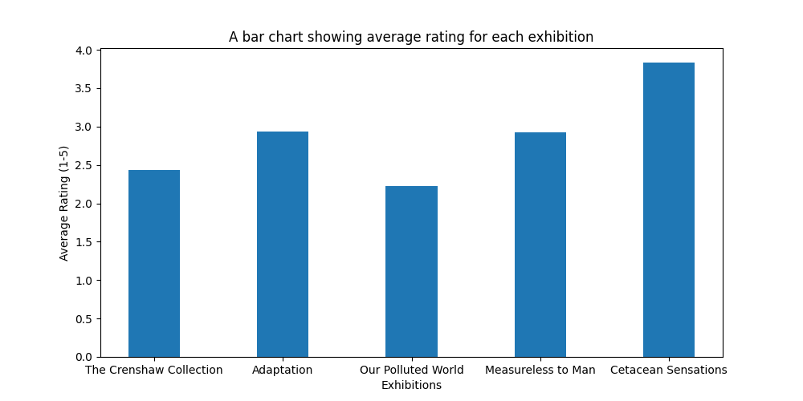
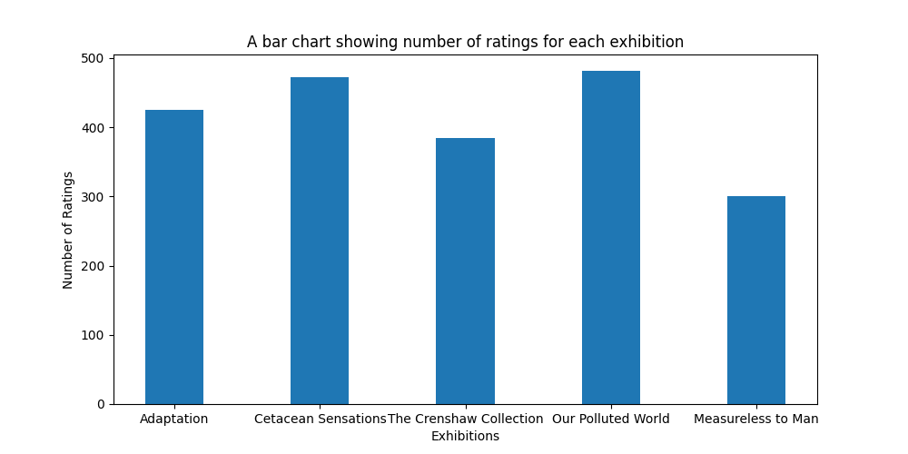
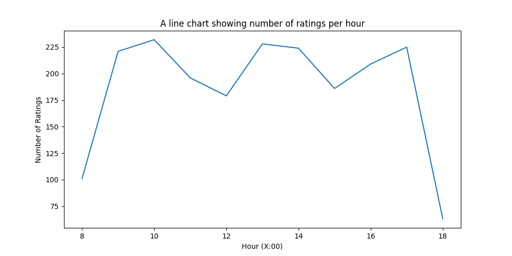
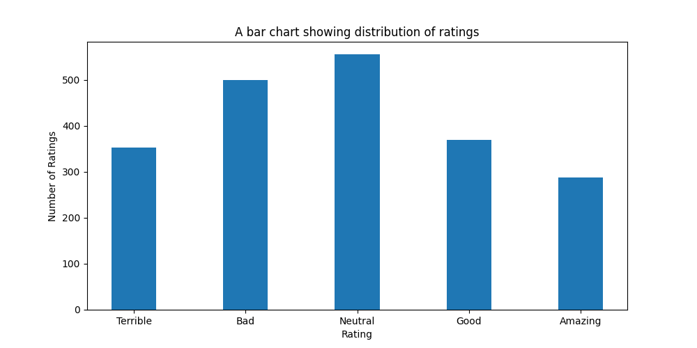
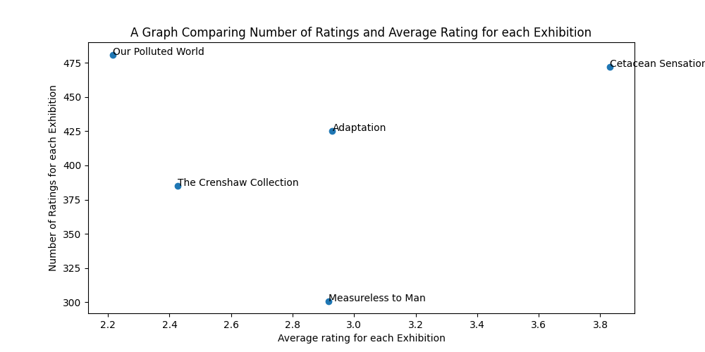

## Report on Based on data from The Liverpool Museum of Natural History (LMNH)

The Liverpool Museum of Natural History (LMNH) hosts hundreds of thousands of visitors every year, coming to view award-winning exhibitions such as "Fossils of the Ancient Nile" and "Inordinately Fond: Biodiversity in Beetles".

LMNH's core mission is 'to provide value to the Liverpool community and the wider public'. As part of this mission, the museum regularly collects data on visitor satisfaction and wellbeing, which is then used to target exhibition development and maintenance. In the past, the museum has collected this data through written surveys and online reviews, but LMNH has recently secured funding for a new project focused on gathering immediate user feedback. This project is currently being trialled in several key exhibitions.

"Smiley Face Survey Kiosks" have been placed at the exits of the exhibitions; visitors are asked to rate their experience of the exhibition on a five-point scale (from 😡 to 😀). Each kiosk features two other buttons: an "assistance" button, for general enquiries, and an "emergency" button for immediate support. Data has been collected from these kiosks and used to produce the graphs below as well as answer other questions.

#### Average Rating For Each Exhibition

You may notice that the Dinosaur Exhibition is missing from this graph. We currently have not gathered any data on this exhibition, but this report will be updated when we have the relevent data.

#### Number of Ratings for Each Exhibition

Here exhibits have been order from oldest (left, _Adaption_) to newest (right, _Measureless to Man_), we would expect there to be less review data for the newer exhibitions, and while this is the case for _Measureless to Man_ there is not a strong trend otherwise.

#### How Ratings Numbers Change During The Day

Low at the start and end of the day, and a dip around lunchtime perhaps. All as would be expected, as these times with less ratings would be times when footfall within the museum is lower.

#### Distribution of Ratings 

We can see the distributions follow a rough normal distribution, however with a slight left-skew- meaning people are leaving more negative reviews than positive ones. This could be due to the fact that people are more motivated to leave feedback when they feel something is not up to standard rather than when everything meets expectations. However I would advise the museum to conduct more research to see whether people are leaving the museum with an overall negative view, because if so something should be done about this.

#### Comparing Number of Ratings and Average Rating for each Exhibition

For context, ratings are stored numerically here, each one does have an associated description that we have used previously:

1: Terrible  
2: Bad  
3: Neutral  
4: Good  
5: Amazing  

We can see from this that the more extreme the view, ie the more the rating deviates from neutral, in general the more ratings are given. This supports our hypothesis that people are more likely to leave ratings when they have stronger opinions.

